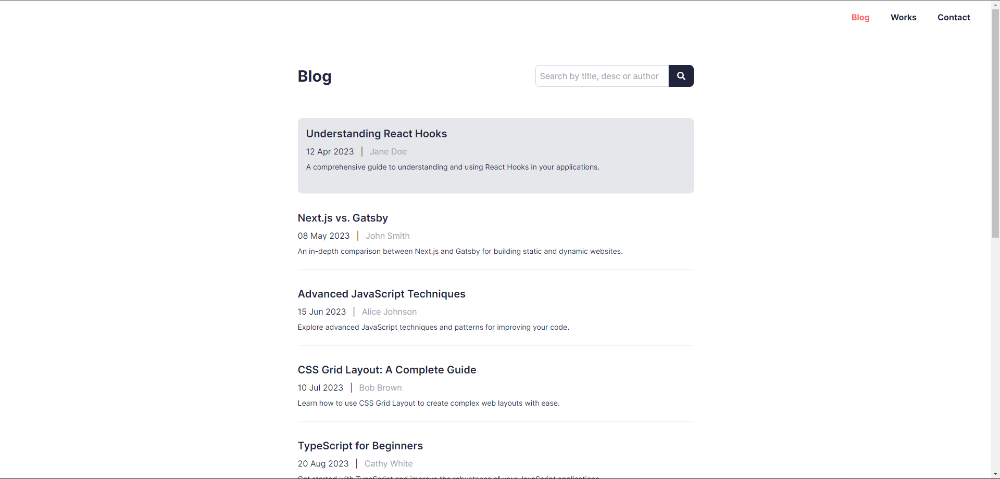

# Blogosphere



A responsive blog page created using Next.js and TypeScript. The design is based on a provided Figma design and includes features like a search bar, responsive layout, and social media links.

## Figma Design Reference

[Portfolio UI - Web & Mobile (Community)](https://www.figma.com/design/QmBB1AoGkxEQP90oJZnCBm/Portfolio-UI---Web-%26-Mobile-(Community)?node-id=0-1&t=ez5H0udg1UEDxeNe-0)

## Project Setup

### Prerequisites

- Node.js (v14 or higher)
- npm or yarn

### Installation

1. Clone the repository:
    ```sh
    git clone <repository_url>
    cd blogosphere
    ```

2. Install dependencies:
    ```sh
    npm install
    # or
    yarn install
    ```

3. Start the development server:
    ```sh
    npm run dev
    # or
    yarn dev
    ```

### Build and Deploy

1. Build the project:
    ```sh
    npm run build
    # or
    yarn build
    ```

2. Start the production server:
    ```sh
    npm start
    # or
    yarn start
    ```

### Running the project locally

To run the project locally, follow these steps:

1. Ensure all dependencies are installed:
    ```sh
    npm install
    # or
    yarn install
    ```

2. Start the development server:
    ```sh
    npm run dev
    # or
    yarn dev
    ```

3. Open your browser and navigate to `http://localhost:3000`


## Design Choices

### Layout

- **Responsive Design:** The layout adjusts to different screen sizes using Tailwind CSS.
- **Navigation:** A header with navigation links that adjust visibility based on screen size.
- **Footer:** Includes social media icons and adheres to the overall design theme.

### Styling

- **Tailwind CSS:** For utility-first CSS to style components.
- **CSS Modules:** For scoped and modular CSS, ensuring styles do not conflict.

### Functionality

- **Search Bar:** Allows users to filter blog posts by title, description, or author.
- **Static Generation:** Blog posts are fetched from a local JSON file using Next.js' static generation.

## Libraries Used

- **Next.js:** For server-side rendering and static site generation.
- **React:** For building UI components.
- **Tailwind CSS:** For styling the components.
- **React Icons:** For social media icons and other icons.
- **TypeScript:** For type safety and better developer experience.

## Additional Features

- **Dark Mode Toggle:** A toggle to switch between light and dark mode.

## Contact

If you have any questions or suggestions, feel free to contact me at prabhat.dev933@gmail.com.
